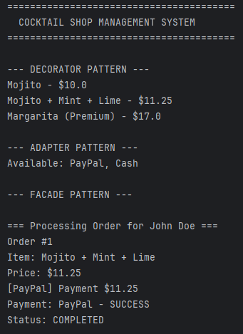
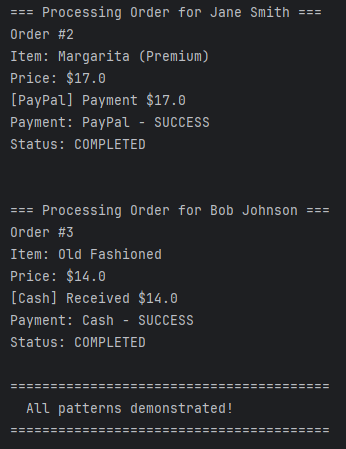

# Laboratory Work #3 - Structural Design Patterns

## Topic: Cocktail Shop Management System

## Author: Mțîu Vladlen, FAF-232

## Introduction

This laboratory work focuses on implementing Structural Design Patterns in a Cocktail Shop Management System. The system allows customers to order cocktails with various customizations, handles payment processing through multiple providers, and provides a simplified interface for complex operations.

## Theory

Structural Design Patterns are concerned with how classes and objects are composed to form larger structures. They help ensure that when one part of a system changes, the entire structure doesn't need to change. These patterns use composition and inheritance to create flexible and efficient designs.

### Patterns Implemented:

1. **Decorator Pattern**: Allows behavior to be added to individual objects dynamically without affecting other objects of the same class. Perfect for adding garnishes, mixers, and extras to cocktails.

2. **Facade Pattern**: Provides a unified interface to a set of interfaces in a subsystem. It simplifies the complex cocktail ordering and preparation process for the client.

3. **Adapter Pattern**: Allows incompatible interfaces to work together. Used to integrate different payment processing systems into a unified payment interface.


## Implementation & Explanation

### 1. Decorator Pattern

**Location**: `src/domain/beverages/`, `src/patterns/decorator/`

The Decorator Pattern is used to dynamically add features to cocktails. Instead of creating a separate class for every possible combination of cocktails and additions, we can "wrap" base cocktails with decorators.

**Key Components**:
- `Cocktail` (interface): Base component
- `BaseCocktail` (abstract): Concrete cocktails like Mojito, Margarita, OldFashioned
- `CocktailDecorator` (abstract): Base decorator
- Concrete decorators: `LimeGarnish`, `MintLeaves`, `ExtraShot`, `PremiumSpirits`, `SodaWater`

**Example Usage**:
```java
Cocktail mojito = new Mojito();
mojito = new MintLeaves(mojito);
mojito = new LimeGarnish(mojito);
mojito = new SodaWater(mojito);
// Result: Mojito with mint leaves, lime garnish, and soda water
```


### 2. Facade Pattern

**Location**: `src/patterns/facade/`

The Facade Pattern provides a simplified interface to the complex subsystems involved in cocktail shop operations.

**Subsystems**:
- `InventoryManager`: Checks ingredient availability
- `OrderManager`: Creates and tracks orders
- `PaymentProcessor`: Handles payment operations
- `NotificationService`: Sends order notifications

**Facade**: `CocktailShopFacade`

**Example Usage**:
```java
CocktailShopFacade shop = new CocktailShopFacade();
shop.placeOrder(customer, cocktail, paymentMethod);
// Handles: inventory check → order creation → payment → notification
```


### 3. Adapter Pattern

**Location**: `src/patterns/adapter/`

The Adapter Pattern is used to integrate different payment systems that have incompatible interfaces.

**Target Interface**: `PaymentMethod`

**Adaptees**:
- `StripePaymentService`: External Stripe API
- `PayPalPaymentService`: External PayPal API
- `CashPaymentService`: Simple cash handling

**Adapters**:
- `StripeAdapter`: Adapts Stripe to our payment interface
- `PayPalAdapter`: Adapts PayPal to our payment interface
- `CashAdapter`: Adapts cash to our payment interface

**Example Usage**:
```java
PaymentMethod stripePayment = new StripeAdapter(new StripePaymentService());
PaymentMethod paypalPayment = new PayPalAdapter(new PayPalPaymentService());
// Both can be used interchangeably
```


## Results

The implementation successfully demonstrates three structural design patterns:

1. **Decorator Pattern**: Allows flexible cocktail customization with any combination of additions
2. **Facade Pattern**: Simplifies complex operations into single method calls
3. **Adapter Pattern**: Integrates multiple payment systems seamlessly




## Conclusions

Structural Design Patterns provide elegant solutions for organizing code and managing relationships between objects:

- **Flexibility**: Decorator allows unlimited customization without code duplication
- **Simplicity**: Facade hides complexity behind a clean interface
- **Extensibility**: Adapter makes it easy to integrate new external services

These patterns make the system maintainable, scalable, and easy to extend with new features. The cocktail shop can easily add new cocktails, decorators, or payment methods without modifying existing code, following the Open/Closed Principle.

The patterns work together seamlessly: decorators create customized cocktails, the facade orchestrates the order process, and adapters handle diverse payment methods - all contributing to a robust and flexible system.

